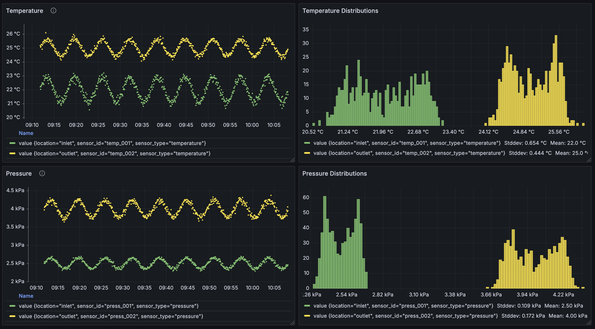

# Grafana Flux Queries for PumpTech Mock Data

This document contains Flux queries for visualizing the mock sensor data in Grafana. The queries are organized by measurement type and visualization purpose.

## Data Structure Overview

The mock data generates the following measurements in InfluxDB:

- **sensors**: General sensor readings (temperature, pressure, flow, level)
- **pump_data**: Comprehensive pump metrics with multiple fields
- **system_metrics**: System health and performance metrics
- **alarms**: Alarm and event data

## Mock Hardware Configuration

The system generates data from:
- **Temperature sensors**: temp_001 (inlet, ~22°C), temp_002 (outlet, ~25°C)
- **Pressure sensors**: press_001 (inlet, ~2.5 bar), press_002 (outlet, ~4.0 bar)
- **Flow sensors**: flow_001 (main_line, ~75 L/min)
- **Level sensors**: level_001 (tank_1, ~60%)
- **Pumps**: pump_001 (main_station), pump_002 (backup_station)

## Visualization Example



---

## Time Series Visualizations

### 1. Temperature Monitoring Dashboard

#### All Temperature Sensors Over Time
```flux
from(bucket: "pumptest")
  |> range(start: v.timeRangeStart, stop: v.timeRangeStop)
  |> filter(fn: (r) => r["_measurement"] == "sensors")
  |> filter(fn: (r) => r["sensor_type"] == "temperature")
  |> filter(fn: (r) => r["_field"] == "value")
  |> aggregateWindow(every: v.windowPeriod, fn: mean, createEmpty: false)
  |> yield(name: "temperature_readings")
```

#### Temperature Difference (Outlet vs Inlet)
```flux
inlet = from(bucket: "pumptest")
  |> range(start: v.timeRangeStart, stop: v.timeRangeStop)
  |> filter(fn: (r) => r["_measurement"] == "sensors")
  |> filter(fn: (r) => r["sensor_id"] == "temp_001")
  |> filter(fn: (r) => r["_field"] == "value")
  |> aggregateWindow(every: v.windowPeriod, fn: mean, createEmpty: false)

outlet = from(bucket: "pumptest")
  |> range(start: v.timeRangeStart, stop: v.timeRangeStop)
  |> filter(fn: (r) => r["_measurement"] == "sensors")
  |> filter(fn: (r) => r["sensor_id"] == "temp_002")
  |> filter(fn: (r) => r["_field"] == "value")
  |> aggregateWindow(every: v.windowPeriod, fn: mean, createEmpty: false)

join(tables: {inlet: inlet, outlet: outlet}, on: ["_time"])
  |> map(fn: (r) => ({
      _time: r._time,
      _value: r._value_outlet - r._value_inlet,
      _field: "temperature_difference"
    }))
  |> yield(name: "temp_difference")
```

### 2. Pressure System Monitoring

#### Pressure Readings with Differential
```flux
from(bucket: "pumptest")
  |> range(start: v.timeRangeStart, stop: v.timeRangeStop)
  |> filter(fn: (r) => r["_measurement"] == "sensors")
  |> filter(fn: (r) => r["sensor_type"] == "pressure")
  |> filter(fn: (r) => r["_field"] == "value")
  |> aggregateWindow(every: v.windowPeriod, fn: mean, createEmpty: false)
  |> yield(name: "pressure_readings")
```

#### Pressure Drop Calculation
```flux
inlet_pressure = from(bucket: "pumptest")
  |> range(start: v.timeRangeStart, stop: v.timeRangeStop)
  |> filter(fn: (r) => r["_measurement"] == "sensors")
  |> filter(fn: (r) => r["sensor_id"] == "press_001")
  |> filter(fn: (r) => r["_field"] == "value")
  |> aggregateWindow(every: v.windowPeriod, fn: mean, createEmpty: false)

outlet_pressure = from(bucket: "pumptest")
  |> range(start: v.timeRangeStart, stop: v.timeRangeStop)
  |> filter(fn: (r) => r["_measurement"] == "sensors")
  |> filter(fn: (r) => r["sensor_id"] == "press_002")
  |> filter(fn: (r) => r["_field"] == "value")
  |> aggregateWindow(every: v.windowPeriod, fn: mean, createEmpty: false)

join(tables: {inlet: inlet_pressure, outlet: outlet_pressure}, on: ["_time"])
  |> map(fn: (r) => ({
      _time: r._time,
      _value: r._value_outlet - r._value_inlet,
      _field: "pressure_gain"
    }))
  |> yield(name: "pressure_gain")
```

### 3. Flow and Level Monitoring

#### Flow Rate Over Time
```flux
from(bucket: "pumptest")
  |> range(start: v.timeRangeStart, stop: v.timeRangeStop)
  |> filter(fn: (r) => r["_measurement"] == "sensors")
  |> filter(fn: (r) => r["sensor_type"] == "flow")
  |> filter(fn: (r) => r["_field"] == "value")
  |> aggregateWindow(every: v.windowPeriod, fn: mean, createEmpty: false)
  |> yield(name: "flow_rate")
```

#### Tank Level Monitoring
```flux
from(bucket: "pumptest")
  |> range(start: v.timeRangeStart, stop: v.timeRangeStop)
  |> filter(fn: (r) => r["_measurement"] == "sensors")
  |> filter(fn: (r) => r["sensor_type"] == "level")
  |> filter(fn: (r) => r["_field"] == "value")
  |> aggregateWindow(every: v.windowPeriod, fn: mean, createEmpty: false)
  |> yield(name: "tank_level")
```

### 4. Comprehensive Pump Performance

#### Pump Flow Rate and Pressure
```flux
from(bucket: "pumptest")
  |> range(start: v.timeRangeStart, stop: v.timeRangeStop)
  |> filter(fn: (r) => r["_measurement"] == "pump_data")
  |> filter(fn: (r) => r["_field"] == "flow_rate" or r["_field"] == "pressure")
  |> aggregateWindow(every: v.windowPeriod, fn: mean, createEmpty: false)
  |> yield(name: "pump_flow_pressure")
```

#### Pump Power Consumption
```flux
from(bucket: "pumptest")
  |> range(start: v.timeRangeStart, stop: v.timeRangeStop)
  |> filter(fn: (r) => r["_measurement"] == "pump_data")
  |> filter(fn: (r) => r["_field"] == "power_consumption")
  |> aggregateWindow(every: v.windowPeriod, fn: mean, createEmpty: false)
  |> yield(name: "pump_power")
```

#### Pump RPM and Vibration
```flux
from(bucket: "pumptest")
  |> range(start: v.timeRangeStart, stop: v.timeRangeStop)
  |> filter(fn: (r) => r["_measurement"] == "pump_data")
  |> filter(fn: (r) => r["_field"] == "rpm" or r["_field"] == "vibration")
  |> aggregateWindow(every: v.windowPeriod, fn: mean, createEmpty: false)
  |> yield(name: "pump_rpm_vibration")
```

#### Pump Temperature Monitoring
```flux
from(bucket: "pumptest")
  |> range(start: v.timeRangeStart, stop: v.timeRangeStop)
  |> filter(fn: (r) => r["_measurement"] == "pump_data")
  |> filter(fn: (r) => r["_field"] == "temperature")
  |> aggregateWindow(every: v.windowPeriod, fn: mean, createEmpty: false)
  |> yield(name: "pump_temperature")
```

### 5. System Health Monitoring

#### System Metrics Overview
```flux
from(bucket: "pumptest")
  |> range(start: v.timeRangeStart, stop: v.timeRangeStop)
  |> filter(fn: (r) => r["_measurement"] == "system_metrics")
  |> filter(fn: (r) => r["_field"] == "metric_value")
  |> aggregateWindow(every: v.windowPeriod, fn: mean, createEmpty: false)
  |> yield(name: "system_metrics")
```

---

## Histogram Visualizations

### 1. Temperature Distribution

#### Temperature Value Distribution (Last 24 Hours)
```flux
from(bucket: "pumptest")
  |> range(start: v.timeRangeStart, stop: v.timeRangeStop)
  |> filter(fn: (r) => r["_measurement"] == "sensors")
  |> filter(fn: (r) => r["sensor_type"] == "temperature")
  |> filter(fn: (r) => r["_field"] == "value")
  |> aggregateWindow(every: v.windowPeriod, fn: mean, createEmpty: false)
  |> yield(name: "temperature_histogram")
```

### 2. Pressure Distribution

#### Pressure Value Distribution
```flux
from(bucket: "pumptest")
  |> range(start: v.timeRangeStart, stop: v.timeRangeStop)
  |> filter(fn: (r) => r["_measurement"] == "sensors")
  |> filter(fn: (r) => r["sensor_type"] == "pressure")
  |> filter(fn: (r) => r["_field"] == "value")
  |> aggregateWindow(every: v.windowPeriod, fn: mean, createEmpty: false)
  |> yield(name: "temperature_histogram")
```

### 3. Flow Rate Distribution

#### Flow Rate Distribution
```flux
from(bucket: "pumptest")
  |> range(start: -24h)
  |> filter(fn: (r) => r["_measurement"] == "sensors")
  |> filter(fn: (r) => r["sensor_type"] == "flow")
  |> filter(fn: (r) => r["_field"] == "value")
  |> histogram(bins: [50.0, 60.0, 70.0, 80.0, 90.0, 100.0])
  |> yield(name: "flow_histogram")
```

### 4. Pump Performance Histograms

#### Pump Power Consumption Distribution
```flux
from(bucket: "pumptest")
  |> range(start: -24h)
  |> filter(fn: (r) => r["_measurement"] == "pump_data")
  |> filter(fn: (r) => r["_field"] == "power_consumption")
  |> histogram(bins: [0.0, 200.0, 400.0, 600.0, 800.0, 1000.0, 1200.0])
  |> yield(name: "pump_power_histogram")
```

#### Pump RPM Distribution
```flux
from(bucket: "pumptest")
  |> range(start: -24h)
  |> filter(fn: (r) => r["_measurement"] == "pump_data")
  |> filter(fn: (r) => r["_field"] == "rpm")
  |> histogram(bins: [0.0, 500.0, 1000.0, 1500.0, 2000.0, 2500.0, 3000.0, 3500.0])
  |> yield(name: "pump_rpm_histogram")
```

#### Pump Vibration Distribution
```flux
from(bucket: "pumptest")
  |> range(start: -24h)
  |> filter(fn: (r) => r["_measurement"] == "pump_data")
  |> filter(fn: (r) => r["_field"] == "vibration")
  |> histogram(bins: [0.0, 0.2, 0.4, 0.6, 0.8, 1.0, 1.2])
  |> yield(name: "pump_vibration_histogram")
```

---

## Statistical Analysis Queries

### 1. Sensor Statistics

#### Temperature Statistics (Min, Max, Mean, Std Dev)
```flux
from(bucket: "pumptest")
  |> range(start: v.timeRangeStart, stop: v.timeRangeStop)
  |> filter(fn: (r) => r["_measurement"] == "sensors")
  |> filter(fn: (r) => r["sensor_type"] == "temperature")
  |> filter(fn: (r) => r["_field"] == "value")
  |> group(columns: ["sensor_id", "location"])
  |> aggregateWindow(every: v.windowPeriod, fn: mean, createEmpty: false)
  |> duplicate(column: "_value", as: "mean")
  |> min(column: "_value")
  |> duplicate(column: "_value", as: "min")
  |> max(column: "_value")
  |> duplicate(column: "_value", as: "max")
  |> stddev(column: "_value")
  |> duplicate(column: "_value", as: "stddev")
  |> yield(name: "temperature_stats")
```

### 2. Pump Efficiency Analysis

#### Pump Efficiency (Flow Rate vs Power Consumption)
```flux
flow_data = from(bucket: "pumptest")
  |> range(start: v.timeRangeStart, stop: v.timeRangeStop)
  |> filter(fn: (r) => r["_measurement"] == "pump_data")
  |> filter(fn: (r) => r["_field"] == "flow_rate")
  |> aggregateWindow(every: v.windowPeriod, fn: mean, createEmpty: false)

power_data = from(bucket: "pumptest")
  |> range(start: v.timeRangeStart, stop: v.timeRangeStop)
  |> filter(fn: (r) => r["_measurement"] == "pump_data")
  |> filter(fn: (r) => r["_field"] == "power_consumption")
  |> aggregateWindow(every: v.windowPeriod, fn: mean, createEmpty: false)

join(tables: {flow: flow_data, power: power_data}, on: ["_time", "sensor_id"])
  |> map(fn: (r) => ({
      _time: r._time,
      sensor_id: r.sensor_id,
      _value: if r._value_power > 0.0 then r._value_flow / r._value_power else 0.0,
      _field: "efficiency_ratio"
    }))
  |> yield(name: "pump_efficiency")
```

---

## Alarm and Event Monitoring

### 1. Alarm Timeline
```flux
from(bucket: "pumptest")
  |> range(start: v.timeRangeStart, stop: v.timeRangeStop)
  |> filter(fn: (r) => r["_measurement"] == "alarms")
  |> filter(fn: (r) => r["_field"] == "message")
  |> yield(name: "alarms")
```

### 2. Alarm Count by Severity
```flux
from(bucket: "pumptest")
  |> range(start: v.timeRangeStart, stop: v.timeRangeStop)
  |> filter(fn: (r) => r["_measurement"] == "alarms")
  |> filter(fn: (r) => r["_field"] == "acknowledged")
  |> group(columns: ["severity"])
  |> count()
  |> yield(name: "alarm_count_by_severity")
```

---

## Advanced Queries

### 1. Correlation Analysis

#### Temperature vs Flow Rate Correlation
```flux
temp_data = from(bucket: "pumptest")
  |> range(start: v.timeRangeStart, stop: v.timeRangeStop)
  |> filter(fn: (r) => r["_measurement"] == "sensors")
  |> filter(fn: (r) => r["sensor_type"] == "temperature")
  |> filter(fn: (r) => r["_field"] == "value")
  |> aggregateWindow(every: 1m, fn: mean, createEmpty: false)
  |> mean()

flow_data = from(bucket: "pumptest")
  |> range(start: v.timeRangeStart, stop: v.timeRangeStop)
  |> filter(fn: (r) => r["_measurement"] == "sensors")
  |> filter(fn: (r) => r["sensor_type"] == "flow")
  |> filter(fn: (r) => r["_field"] == "value")
  |> aggregateWindow(every: 1m, fn: mean, createEmpty: false)

join(tables: {temp: temp_data, flow: flow_data}, on: ["_time"])
  |> yield(name: "temp_flow_correlation")
```

### 2. Anomaly Detection

#### Detect Temperature Anomalies (Values > 2 Standard Deviations)
```flux
from(bucket: "pumptest")
  |> range(start: -7d)
  |> filter(fn: (r) => r["_measurement"] == "sensors")
  |> filter(fn: (r) => r["sensor_type"] == "temperature")
  |> filter(fn: (r) => r["_field"] == "value")
  |> group(columns: ["sensor_id"])
  |> aggregateWindow(every: 1m, fn: mean, createEmpty: false)
  |> duplicate(column: "_value", as: "original_value")
  |> mean(column: "_value")
  |> duplicate(column: "_value", as: "mean_value")
  |> stddev(column: "_value")
  |> duplicate(column: "_value", as: "stddev_value")
  |> map(fn: (r) => ({
      r with
      upper_bound: r.mean_value + (2.0 * r.stddev_value),
      lower_bound: r.mean_value - (2.0 * r.stddev_value),
      is_anomaly: r.original_value > (r.mean_value + (2.0 * r.stddev_value)) or
                  r.original_value < (r.mean_value - (2.0 * r.stddev_value))
    }))
  |> filter(fn: (r) => r.is_anomaly == true)
  |> yield(name: "temperature_anomalies")
```

---

## Dashboard Setup Tips

### Panel Configuration Recommendations:

1. **Time Series Panels**: Use for all sensor readings, pump metrics, and system health
2. **Histogram Panels**: Use for value distribution analysis
3. **Stat Panels**: Use for current values and statistics
4. **Table Panels**: Use for alarm lists and system status
5. **Gauge Panels**: Use for current sensor values with thresholds

### Variable Setup:
Create dashboard variables for:
- `sensor_id`: Multi-select dropdown for sensor filtering
- `location`: Multi-select dropdown for location filtering
- `time_range`: Time range picker

### Refresh Settings:
- Set auto-refresh to 5s or 10s for real-time monitoring
- Use relative time ranges (last 1h, last 24h, etc.)

### Alerting:
Set up alerts for:
- Temperature thresholds (> 30°C or < 15°C)
- Pressure anomalies (< 1 bar or > 6 bar)
- Pump vibration levels (> 1.0)
- System health metrics

---

## Query Performance Tips

1. **Use appropriate time ranges**: Avoid querying large time ranges unnecessarily
2. **Leverage aggregateWindow()**: Use for downsampling high-frequency data
3. **Filter early**: Apply measurement and field filters as early as possible
4. **Use group()**: Group by relevant tags to organize data properly
5. **Consider data retention**: Adjust queries based on your InfluxDB retention policy

---

## Troubleshooting

### Common Issues:

1. **No data returned**: Check bucket name, measurement names, and time range
2. **Performance issues**: Reduce time range or increase aggregation window
3. **Missing fields**: Verify field names match the data model
4. **Incorrect grouping**: Ensure group() columns match your tag structure

### Debugging Queries:
Add `|> yield(name: "debug")` at different stages to inspect intermediate results.
